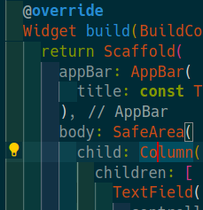
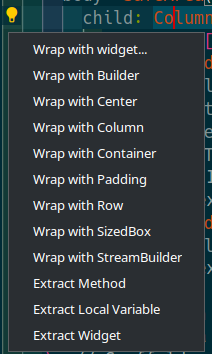

# flutter inititiation

Creating a todolist in flutter

# Instalation

[Installation link](https://docs.flutter.dev/get-started/install)

[Editor setup](https://docs.flutter.dev/get-started/editor)

to verify your installation at any point: `flutter doctor`

# Getting Started

[Flutter docs](https://docs.flutter.dev)

In flutter, everything is a widget.

There are two types of widget: stateless, and statefull.

## Stateless widget

'State less' widget are, like the name implies, without a state.
They don't change and are immutable. Its appearance and properties remain unchanged throughout the lifetime of the widget. In simple words, Stateless widgets cannot change their state during the runtime of the app, which means the widgets cannot be redrawn while the app is in action.

## Statefull widget

the 'State full' widget are dynamic, they are mutable and can be drawn multiple times during its lifetime. It can change its appearance in response to events triggered by user interactions or when it receives data.

## Creating a project

For every flutter related action, you can use the `flutter` cli.

to create a flutter app : `flutter create workshop_flutter`

It create a sample app and all nessecary file to build on all enabled platforms :
- android
- ios
- macos
- linux
- windows

One folder for each platform has been created. if not, you may need to enable them (optional if you have an android or ios folder)

- `flutter config --[no-]enable-{windows,linux,macos}-desktop`
- `flutter config --[no-]enable-{android,ios}`

You can start your app by running `flutter run`, or select a device by using the -d flag.

You may need to install android studio / xCode for an emulator depending if you are on a computer or a mac.

# First app - todo list

Let's create our first app !

In the current state, the demo app is a counter that increment each time you press the + button.

**everything is well explained in the code, so you may want to take a look.**

for those of you who are familiar with react state, its exactly the same, flutter rebuild the widget after a new state has been generated.

## Step 1 - Task page & learn the basic widget

Let's create a new file `taskpage.dart` to hold our new widget,
define a new statefull widget and it's state.

Like the demo, we will use a [Scafold] widget as a base and a [SafeArea] child. Set a [AppBar] too.
For now, we only used the `child` property, but now, we want a list of widgets to ask for a `tittle`, `description` and a list of `task`.

### First, let's create these variable in the state class.

There is plenty of widget that let you do that, but in this case we will just take a [Column]. we could have used a [Stack] or a [Row] if we wanted ([Stack] is a bit special).

For the input, we will use a [TextField] widget, with a [TextEditingController].
To tell the text controller to update our variable, we will use the `..` operator ([doc](https://dart.dev/guides/language/language-tour#cascade-notation)), because its much more practical.
we will set the `text` setter of the controller to our var.

**We will do that one more time for our description**

Now, let's replace our home widget in `main.dart` by ours.

it's not realy pretty, so let's fix that !

### Decoration

Like I said earlier, everything is a widget, or to be precise, a class.

under the decoration property on our text field, create a [InputDecoration] widget and do something.

next, the input is realy on the edge of the screen, so let's add a bit of padding.

for that, we will use... the [Padding] widget !

for those of you who did setup your editor for flutter, you may have something like this




It's realy practical for wraping a already existing widget or extract it to a newly created one.

for now, let's wrap our [Column] inside a [Padding] widget.
By default, it added a padding of 8 on all side with a [EdgeInsets].
Just let it be for now.

We will be adding a style to your title, to make it bigger.
As you can see, there is no size or font size property in the [InputDecoration] widget, because its in the style one that the text itself is decorated.
there is two main way to do that, create a [TextStyle] widget, or use a theme.
You can use the one you want, but I will go with the theme one, cause it's more fun !

there is already an example of this in the home widget created by flutter, so let's just copy and edit it to fit our need. I think headline 4 is a little too big, so let's go for headline 5.

now let's say I want to put it more to the right with an back image left to it.
I let you wrap the title [TextField] into a [Row] and let you [download theses images](https://github.com/STMiki/WorkshopFlutter/raw/master/assets.tar.gz) and extract it.

### Now let's add them to your project !

You have a [pubspec.yaml](pubspec.yaml)
in the root of your project, take a look at it and add the images folder to your project assets. You can add image by image or the whole folder. If you do so, end your path with a `/` !

rerun `flutter run` and you are good ! ...or not.
in doing so you will normaly encounter a error telling you how a [InputDecoration] can't have an unbouded width bla bla bla.
The cause of that is because you wrapped it inside a [Row], and it is trying to calculate how many space it has left. Two way or correcting it, you set a width to it, or you wrap it under a [Expanded] or [Flexible] widget to tell it to take the remaining space.
perform a hot reload and now you are good !

now, let's go back to our image.
You know the drill by now, just add an [Image] widget and since its a assets, set the image property to an [AssetImage].

Let's wrap our image  with a [GestureDetector] and use the onTap event. We use the [Navigator api] to go back to our precedent location, our home screen, that we have not created yet.

Before that, we need a place to store our tasks and todo, so let's go !

## Stocking our info

There is multiple way to stock data with a flutter app. Honnestly what I am gonna do is a bit stupid and there is more suitable way to stock data. But, like I said, I am a bit stupid, so I will just store a sqlite database file and write directly to it.
I already used that in the past so I will just adapt and reuse the code. :)

First, let's add the needed package.
To add a package with flutter, you use the `flutter pub` command, that use the dart package manager internaly to get the package.
So dart and flutter package works with it. all flutter package are available [here](https://pub.dev/).
We will install 4 packages:
- sqflite
- path
- sqflite_common_ffi
- sqlite3_flutter_libs

Unfortunaly, the `flutter pub get` command accept only one package, so just add the following to your [pubspec.yaml](pubspec.yaml)
in the `dependencies` section and run `flutter pub get`
```yaml
  sqflite: ^2.0.2
  path: ^1.8.0
  sqflite_common_ffi: ^2.1.0+2
  sqlite3_flutter_libs: ^0.5.4
```

[download theses files](https://github.com/STMiki/WorkshopFlutter/raw/master/storage_file.tar.gz) and you will be good.
I don't realy want to explain SQL and such so we will use theses.

## Step 2 - Creating the main logic

Create a homepage file with a statefull widget, and reuse the [Scafold] and [SafeArea] combo.
For our home screen, we will use a special type of widget, called builders.
specifically a [FutureBuilder]. these don't have a child property, but a builder function property that let you put custom logic
to show the widget you want.

For those of you who are familiar with javascript, [Future](https://dart.dev/codelabs/async-await) is a Promise.
Like copy/paste. it's the same. the async function part is the same too.

the particularity of the [FutureBuilder] is that it builds your widget with a default value and when your Future has resolved or failled.

The function take the context and a [AsyncSnapshot](https://api.flutter.dev/flutter/widgets/AsyncSnapshot-class.html).
When you know the type of your data, hard code it. It set the [AsyncSnapshot] type too !
```dart
FutureBuilder<List<String>>(
    initialData: const [],
    future: getWordList(),
    builder: (context, snapshot) {
        return ListView.builder(
            itemCount: snapshot.data!.length,
            itemBuilder: (context, index) {
                return Text(snapshot.data![index]);
            }
        );
    }
)
```

With this, you know what I want you to do right ? Use the [DatabaseHelper](##Stocking-our-info) class with the `getTasks` function to display all the stored tasks.

Now, just add a button to add a task. use the [Navigator api] to do it ([MaterialPageRoute])

<hr/>

### Improving the taskpage

Now, we want to access and modify the already stocked task. We already have a task page, but it is incomplete. The data we write there is not stored in the database. that's your job '-'

<details>
    <summary>Hint #1</summary>

    the [TextField] is a stateful widget. maybe there is some event when the user has finished editing the text ?
</details>

<details>
    <summary>Hint #2</summary>

    the `onEditingComplete` is nice, but don't pass the data to me. maybe there is another usefull event ?
</details>

<hr/>

for the todo part, I will help you a litte. We want an unlimited amount of todo for each task, but we need to have a [TextField] to add them. for the list of todo, I think you know what can do the job :eyes:

Honestly, just a [TextField] who add the todo ([DatabaseHelper](##Stocking-our-info)) and reset it's text state :)

Now, challenge, how do we make a checkmark ? think about it (and look at the asset). I will just tell you that it is a 20x20 box.

<details>
    <summary>No.</summary>

    [BoxDecoration] you cheater :)
</details>

<hr/>

The last thing to do, is to add a contructor that can take a task, and set the state (title & description)

At this point, the only thing to add, is a delete option.

## Step 3 - ohh shiny

Just make it pretty. Oh, to remove this horrible thing that is the debug banner, there is an option in the [MaterialApp] widget :wink:

You can add anything, like [Image], [Padding], [Decoration], etc...

for Font, use the fontFamily property in the [ThemeData] ([doc](https://docs.flutter.dev/cookbook/design/fonts))

Usefull widget:
- [Positioned]
- [GestureDetector]
- [Container]
- [Expanded]
- [Visibility]
- [Colors]

[Scafold]: https://api.flutter.dev/flutter/material/Scaffold-class.html
[SafeArea]: https://api.flutter.dev/flutter/widgets/SafeArea-class.html
[Column]: https://api.flutter.dev/flutter/widgets/Column-class.html
[Stack]: https://api.flutter.dev/flutter/widgets/Stack-class.html
[Row]: https://api.flutter.dev/flutter/widgets/Row-class.html
[TextField]: https://api.flutter.dev/flutter/material/TextField-class.html
[TextEditingController]: https://api.flutter.dev/flutter/widgets/TextEditingController-class.html
[AppBar]: https://api.flutter.dev/flutter/material/AppBar-class.html
[InputDecoration]: https://api.flutter.dev/flutter/material/InputDecoration-class.html
[InputBorder]: https://api.flutter.dev/flutter/material/InputBorder-class.html
[Padding]: https://api.flutter.dev/flutter/widgets/Padding-class.html
[EdgeInsets]: https://api.flutter.dev/flutter/painting/EdgeInsets-class.html
[TextStyle]: https://api.flutter.dev/flutter/dart-ui/TextStyle-class.html
[Expanded]: https://api.flutter.dev/flutter/widgets/Expanded-class.html
[Image]: https://api.flutter.dev/flutter/widgets/Image-class.html
[AssetImage]: https://api.flutter.dev/flutter/painting/AssetImage-class.html
[GestureDetector]: https://api.flutter.dev/flutter/widgets/GestureDetector-class.html
[FutureBuilder]: https://api.flutter.dev/flutter/widgets/FutureBuilder-class.html
[Navigator api]: https://api.flutter.dev/flutter/widgets/Navigator-class.html
[BoxDecoration]: https://api.flutter.dev/flutter/painting/BoxDecoration-class.html
[Decoration]: https://api.flutter.dev/flutter/painting/Decoration-class.html
[ThemeData]: https://api.flutter.dev/flutter/material/ThemeData-class.html
[MaterialApp]: https://api.flutter.dev/flutter/material/MaterialApp-class.html
[Positioned]: https://api.flutter.dev/flutter/widgets/Positioned-class.html
[MaterialPageRoute]: https://api.flutter.dev/flutter/material/MaterialPageRoute-class.html
[Container]: https://api.flutter.dev/flutter/widgets/Container-class.html
[Visibility]: https://api.flutter.dev/flutter/widgets/Visibility-class.html
[Colors]: https://api.flutter.dev/flutter/material/Colors-class.html
